[简体中文](README.md) | [English](#)

# FreeCAD MCAD Integration — EasyEDA Pro Extension

Real-time collaboration between EasyEDA Pro and FreeCAD for PCB 3D models via WebSocket. Supports model export, bidirectional position sync, cross-highlight, and delete sync.

## Features

| Feature | Description |
| --- | --- |
| 3D Model Export | Transfer PCB STEP models to FreeCAD in chunks, supports large files |
| Download Script | Save the FreeCAD macro script to local with one click |
| Bidirectional Position Sync | Drag a component in EDA → FreeCAD follows, and vice versa |
| Cross-Highlight | Click a component on one side, the other side auto-focuses |
| Delete Sync | Delete a component in EDA, FreeCAD removes it simultaneously |
| Designator Rename | Mapping auto-updates after renaming |
| Import Heartbeat | Continuously sends progress during large file import to prevent timeout |

***

## Requirements

| Item | Requirement |
| --- | --- |
| EasyEDA Pro | ≥ 3.0 |
| FreeCAD | ≥ 1.0 |
| Network | Localhost available |

***

## Installation

### Step 1: Install FreeCAD Macro Script

1. Open **FreeCAD**
2. In the top menu bar, click **Macro** → **Macro Editor** (or press `Alt+F8`)
   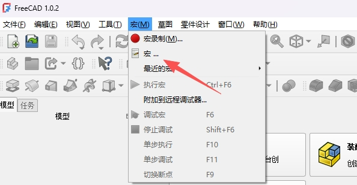
3. In the Macro Editor, click **New** (or `Ctrl+N`) to create a new macro
4. Open the file [script/Interactive-with-easyeda.py](https://github.com/easyeda/eext-mcad-integration-with-freecad/blob/main/script/Interactive-with-easyeda.py) from this project, copy and paste all contents into the Macro Editor (the script can also be saved locally via menu **FreeCAD MCAD Integration** → **Download Script**)

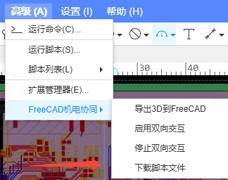

1. Click **Save** (`Ctrl+S`), name the macro, and save it to the default macro directory
2. Click **Run or double-click to run** (green triangle button, or `Ctrl+F5`) to execute the script
   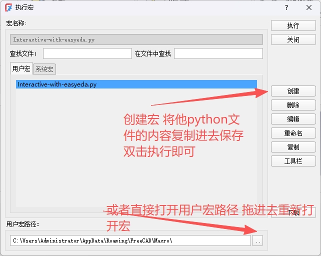
3. **Verify successful startup**: Click **View** → **Panels** → check **Report View**, you should see the following in the bottom Report View:

```
Checking websockets library...
websockets library installed
Initializing WebSocket server 0.0.0.0:8766
WebSocket server started successfully!
Address: ws://localhost:8766
FreeCAD environment detected, server started
Registered main thread timer (100ms message queue polling)
Registered position listener timer (500ms position+selection+delete polling)
Waiting for client connection...
```

> **Tip:** The script automatically detects and installs the `websockets` Python library. The first run may take a few seconds to install dependencies. If automatic installation fails, see the FAQ below.

### Step 2: Install EDA Extension

1. Open **EasyEDA Pro**
2. After installation, find **FreeCAD MCAD Integration** in the extension list and confirm it is enabled
   **Enable External Interaction permission**: Click **Extensions** → **Extension Settings** → Enable **External Interaction** permission (required for WebSocket communication)
   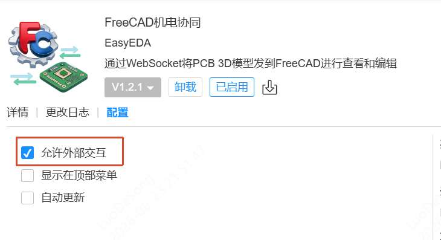

## Usage Guide

### 1. Export 3D Model to FreeCAD

Ensure the FreeCAD macro script is running, then in EDA:

1. Open a PCB design file, enter the **PCB Editor**
2. In the top menu, click **FreeCAD MCAD Integration** → **Export 3D to FreeCAD**

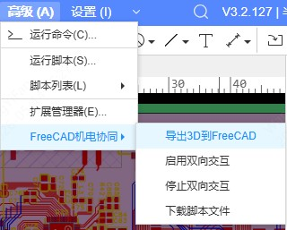

1. On first use, it will automatically connect to the FreeCAD server. You'll see the prompt "Connecting to FreeCAD server..."

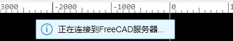

2. After connection is established, it automatically fetches the STEP file and uploads it in chunks. You'll see "PCB STEP file fetched successfully"

3. After upload completes, FreeCAD begins import. EDA shows "Importing STEP file to FreeCAD..."

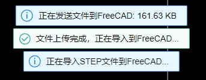

4. Import complete, EDA shows "PCB import completed". The 3D model appears in FreeCAD

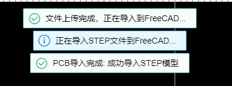

> **Note:** Large files (many components, complex 3D models) may take several minutes to import. During import, the FreeCAD interface will be unresponsive — this is normal. The background heartbeat keeps the connection alive and will not disconnect.

### 2. Enable Bidirectional Interaction

After exporting the model, you can enable bidirectional interaction for real-time sync:

1. Click menu **FreeCAD MCAD Integration** → **Enable Bidirectional Interaction**


2. EDA automatically maps component designators to FreeCAD 3D objects (three-round matching: exact match → regex match → position match)
3. After mapping succeeds, you'll see "Bidirectional interaction started"
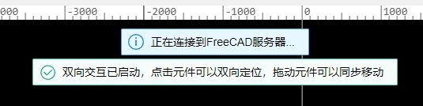

Now you can:

- **Drag a component in EDA** → The 3D model in FreeCAD moves in real time
- **Drag an object in FreeCAD** → The component in EDA moves simultaneously
- **Click a component in EDA** → FreeCAD auto-selects and focuses
- **Click an object in FreeCAD** → EDA auto-navigates to the corresponding component

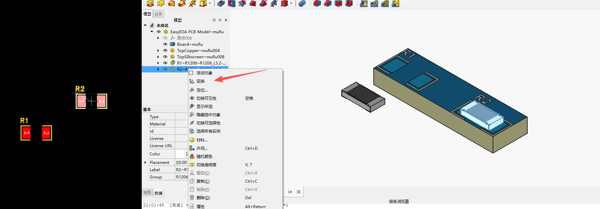

### 3. Stop Bidirectional Interaction

1. Click menu **FreeCAD MCAD Integration** → **Stop Bidirectional Interaction**
   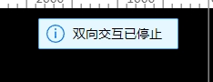
2. All mappings and listeners will be cleared

### 4. Connection Management

| Menu Option | Function |
| --- | --- |
| Export 3D to FreeCAD | Auto-connect + chunked upload + import |
| Enable Bidirectional Interaction | Start real-time bidirectional sync |
| Stop Bidirectional Interaction | Stop sync and clear mappings |
| Connect to FreeCAD | Manually establish WebSocket connection |
| Disconnect from FreeCAD | Disconnect (menu provided by EDA extension framework) |
| Check FreeCAD Connection | View current connection status |

***

## Technical Details

| Item | Description |
| --- | --- |
| Protocol | WebSocket (JSON), address `ws://localhost:8766` |
| File Format | STEP (.step) |
| File Transfer | 512KB chunked Base64 encoding, supports large files |
| Threading | FreeCAD main thread (QTimer) + WebSocket async thread + message queue |
| Import Heartbeat | Background heartbeat thread sends progress every 2 seconds to prevent timeout during large file import |

***

## FAQ

### Failed to connect to FreeCAD

Check in order:

1. **Is FreeCAD running** and the macro script executed
2. **Is port 8766 occupied** — If FreeCAD was not closed properly last time, the port may be lingering. Close all FreeCAD processes and retry
3. **External Interaction permission** — Is External Interaction enabled in EDA extension settings
4. **Firewall** — Check if Windows Firewall is blocking port 8766

### websockets library auto-installation failed

Install manually:

```shell
Command example
"<FreeCAD installation directory>/bin/python.exe" -m pip install websockets==13.1

Windows example
"C:\Program Files\FreeCAD 1.1.1\bin\python.exe" -m pip install websockets==13.1

macOS example
"/Applications/FreeCAD.app/Contents/Resources/bin/python3" -m pip install websockets==13.1
```

### FreeCAD freezes during large file import

This is normal. FreeCAD's STEP parsing uses the OpenCASCADE kernel, which is single-threaded. A PCB with 80 components typically takes several minutes. During import:

- FreeCAD interface will be unresponsive
- EDA will receive `import_progress` heartbeat messages (visible in console)
- FreeCAD automatically recovers after import completes

**Performance tip:** Higher single-core CPU performance means faster import; sufficient memory avoids disk swapping.

### FreeCAD Report View shows errors after import

Click **View** → **Panels** → **Report View** to open the log panel and check detailed error messages. Common issues:

- STEP file incomplete → Re-export
- FreeCAD version too old → Upgrade to 1.0 or above

### Multiple instances cause sync issues

Opening multiple instances of EasyEDA Pro and FreeCAD and switching between them can cause sync misalignment.

- Currently only one-to-one connections are supported. Multiple PCBs or multiple FreeCAD documents will cause data mixing. Do not open multiple PCBs and enable sync simultaneously.

### Bidirectional interaction position out of sync

1. Confirm you have **exported the model first**, then enabled bidirectional interaction
2. Check the mapping log in FreeCAD's Report View to confirm the number of matched components
3. If the match count is 0, the designator format may be non-standard. Try checking the object Label in FreeCAD

***

## Project Structure

```
pcb-export-to-freeCad/
├── src/
│   └── index.ts                         # EDA extension main logic (TypeScript)
├── script/
│   ├── Interactive-with-easyeda.py      # FreeCAD WebSocket server (Python macro)
│   ├── eda_api_reference.md             # EDA extension API reference manual
│   └── PCB-FreeCAD双向协同实践.md         # Technical blog article
├── config/
│   ├── esbuild.common.ts                # Build config
│   └── esbuild.prod.ts
├── build/
│   ├── packaged.ts                      # Packaging script
│   └── dist/
│       └── mcad-integration-with-freecad_v1.0.0.eext  # Release package
├── locales/
│   ├── zh-Hans.json                     # Chinese translation
│   └── en.json                          # English translation
├── images/
│   └── logo.png                         # Extension icon
├── extension.json                       # Extension manifest
├── package.json
└── tsconfig.json
```
